## Hardware Information

### PCB

- Board: NST280
- M10-BK3633-Q40-A3311-A
- Revision Date: 2025-02-26-V0.1

### Main SoC

- Manufacturer: Beken
- Part Number: BK3633QN40E; possible [BK3633QN40](https://www.bekencorp.com/en/goods/detail/cid/43.html)
- Marking: EU430PFQ
- Pins: 10 pins per side

### Optical Sensor

- Manufacturer: PixArt
- Part Number: PAW3311DB-T2MU
- Marking: N4449335C

### Battery Charging IC

- Part Number: TP4066
- Marking: B2511H
- Function: Single-cell Li-Ion charging controller

### Clock

- Frequency: 16.000 MHz
- Type: SMD Crystal Oscillator

### Scroll Encoder

- Manufacturer: F-Switch
- Type: Mechanical Incremental Encoder

### Main Buttons

#### Left Click

- Manufacturer: HUANO
- Marking: `0.05A 30V AC`
- Pins: `C`, `NO`, `NC`

#### Right Click

- Manufacturer: HUANO
- Marking: `0.05A 30V AC`
- Pins: `C`, `NO`, `NC`

#### Middle Click

- Manufacturer: HUANO
- Marking: `0.05A 30V DC`
- Pins: `C`, `NO`, `NC`

## Images

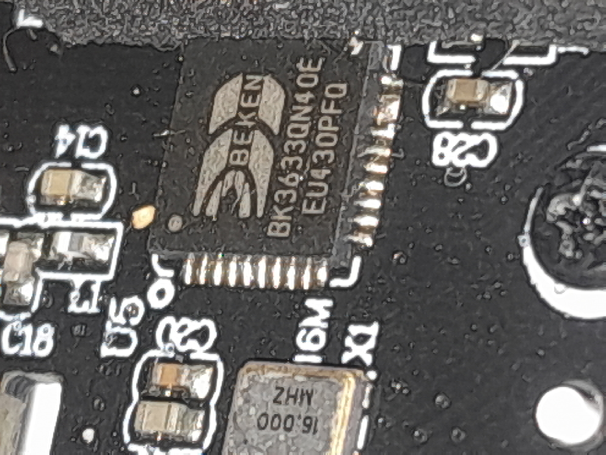
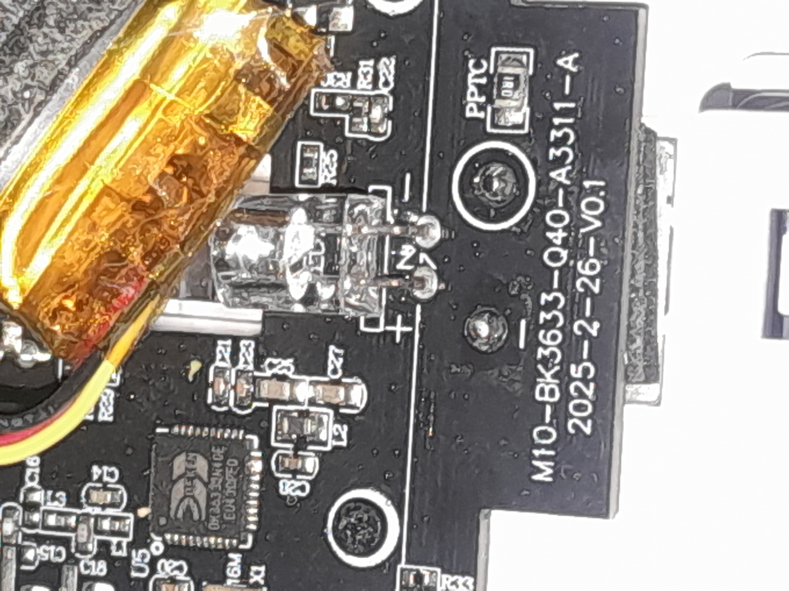
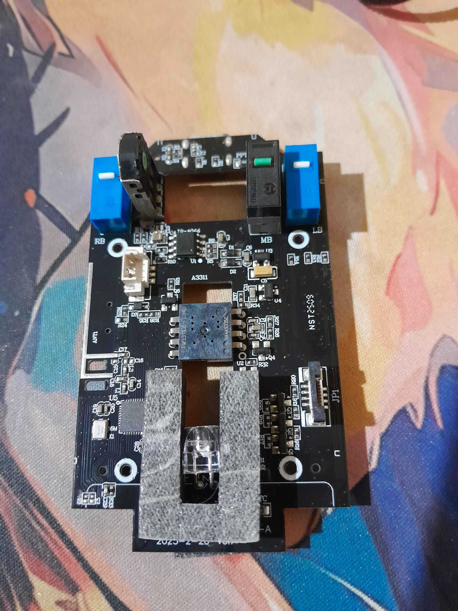
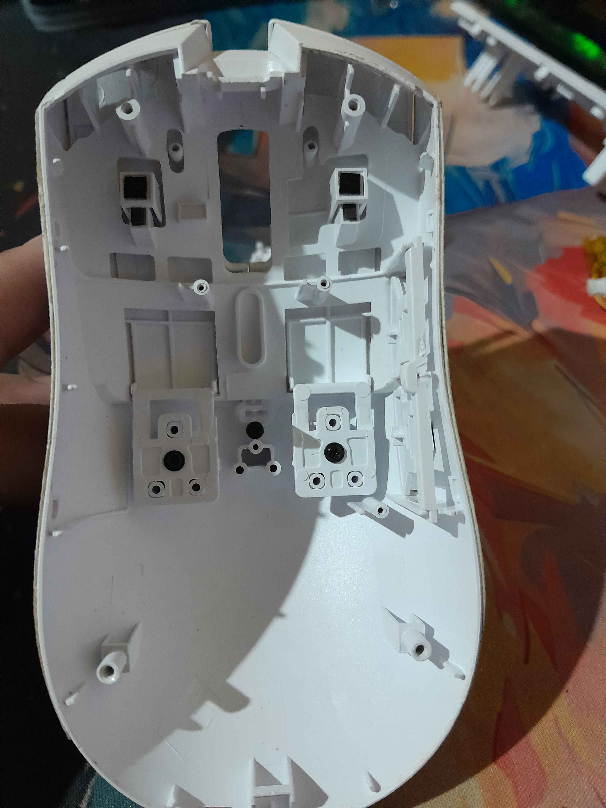
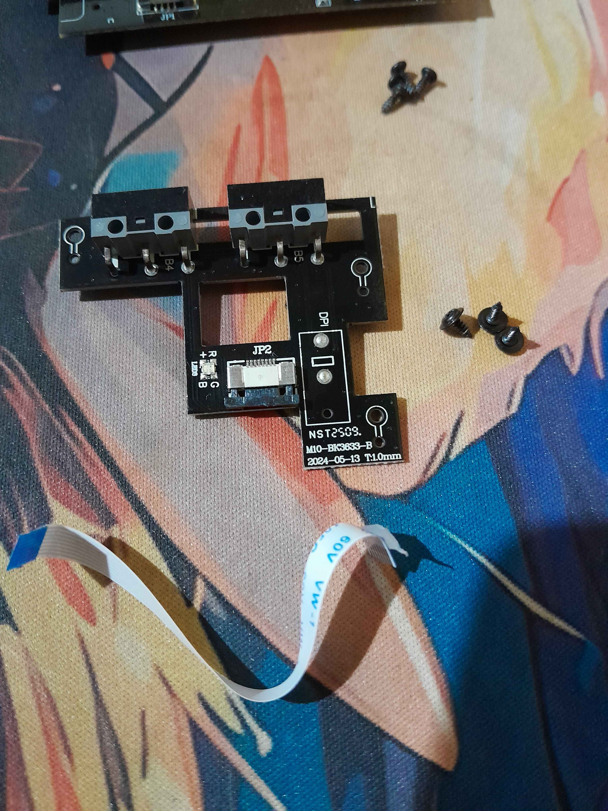
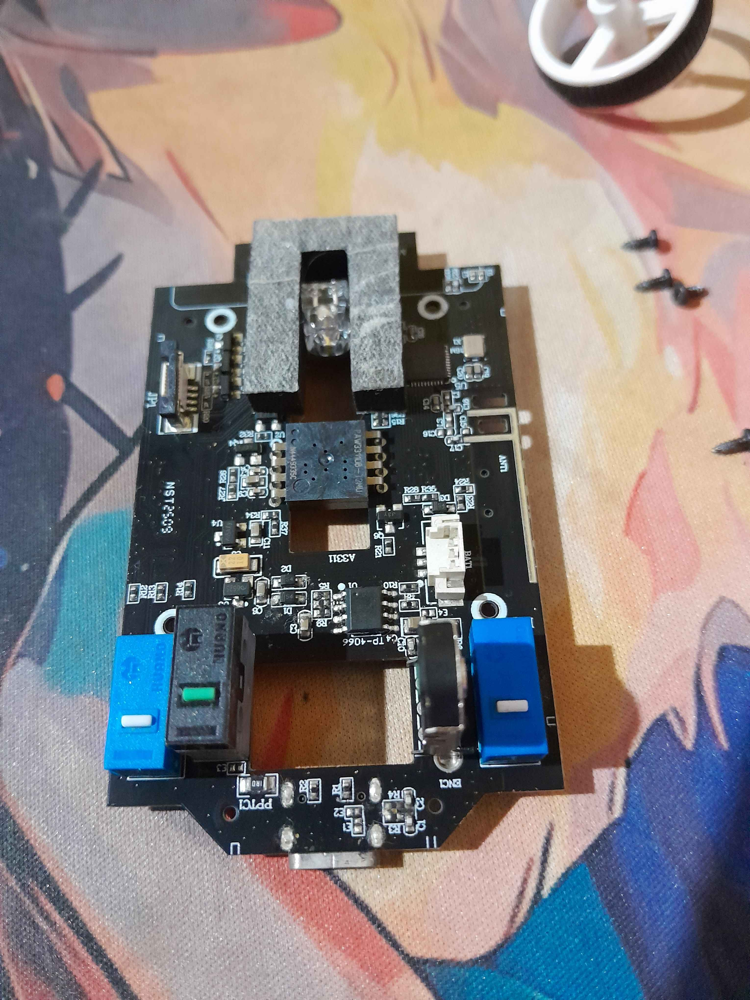
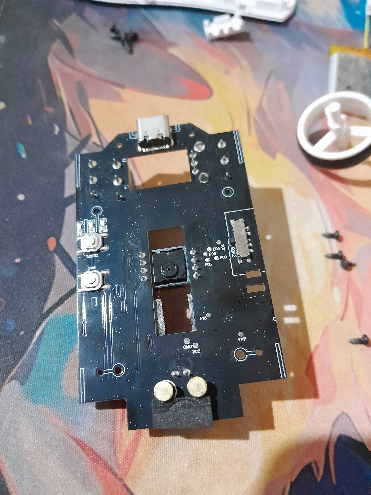

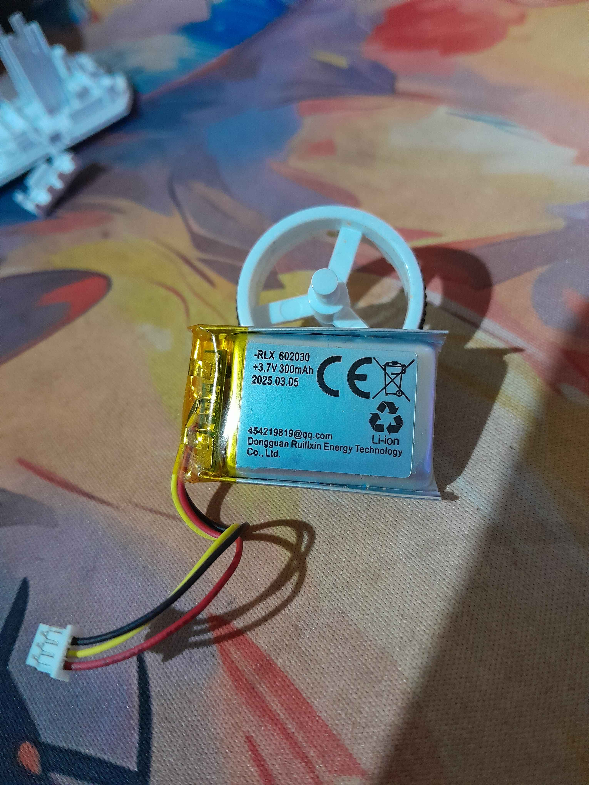
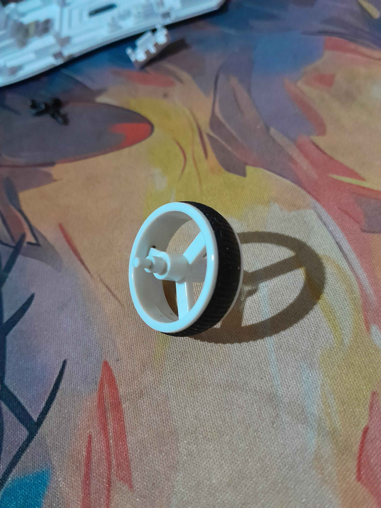
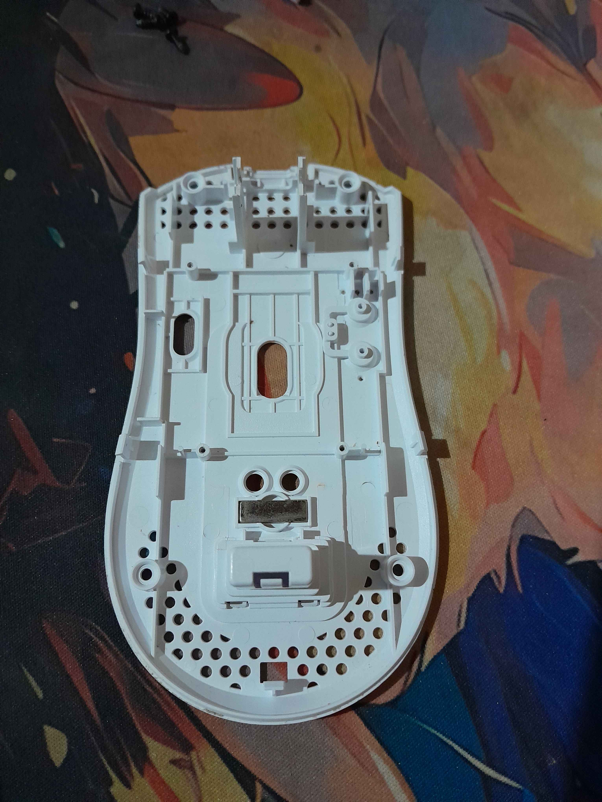
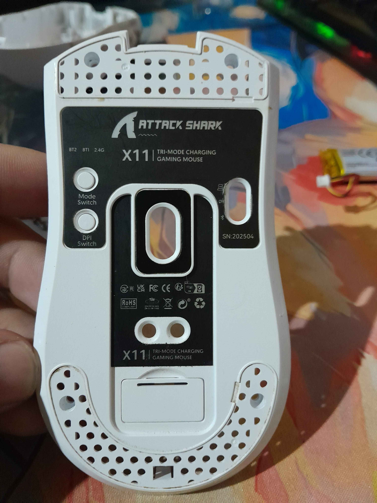
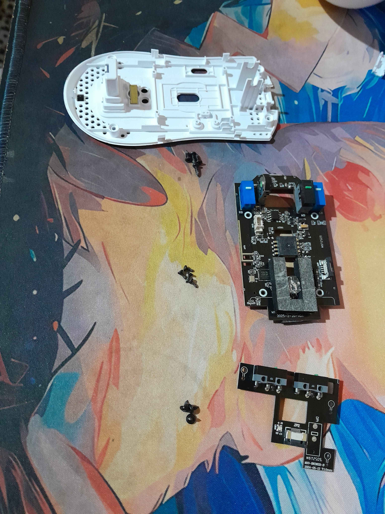

