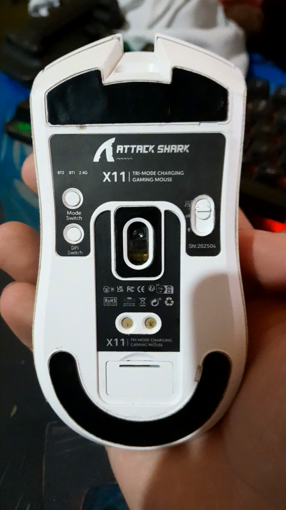

# Profile Settings

This document explains how to read and write the device's profile configuration.

## Overview

This protocol allows configuring how many profiles are available on the device and also allows switching between them.

## Writing Profile Settings

| Offset | Description       | Default Example |
|--------|-------------------|-----------------|
| 0      | Report ID         | `0x0c`          |
| 1      | Packet Length     | `0x0a`          |
| 2      | Current Profile   | `0x01`          |
| 3      | `(~byte2 & 0xff)` | `0xfe`          |
| 4      | Max Profiles      | `0x01`          |
| 5      | `(~byte4 & 0xff)` | `0xfe`          |
| 6      | Padding           | `0x00`          |
| 7      | Padding           | `0x00`          |
| 8      | Padding           | `0x00`          |
| 9      | Padding           | `0x00`          |

When operating in wired mode, the padding bytes are not sent.

## Reading Profile Settings

| Offset | Description       | Default Example |
|--------|-------------------|-----------------|
| 0      | Report ID         | `0x0c`          |
| 1      | Packet Length     | `0x0a`          |
| 2      | Current Profile   | `0x01`          |
| 3      | `(~byte2 & 0xff)` | `0xfe`          |
| 4      | Max Profiles      | `0x01`          |
| 5      | `(~byte4 & 0xff)` | `0xfe`          |
| 6      | Padding           | `0x00`          |
| 7      | Padding           | `0x00`          |
| 8      | Padding           | `0x00`          |
| 9      | Padding           | `0x00`          |

## Macros

It is worth mentioning `FirmwareAction.PROFILE_CYCLE` and its variants.

For these macros to be practically useful, the additional profiles must first be initialized, and the same
profile-switching macro must be assigned to the corresponding button in each profile.

Otherwise, once the user switches to another profile, the button configuration from the previous profile is no longer
active. If the destination profile does not contain the same profile-switching macro, the user may effectively become
stuck on that profile.

Therefore, the same profile-switching macro should be written to the same button in every profile that participates in
the profile cycle.

Another observable behavior is that when the active profile is changed using `FirmwareAction.PROFILE_CYCLE` or one of
its variants, the LEDs on the bottom of the mouse blink, as shown in the GIF below:



Macros such as `FirmwareAction.PROFILE_UP` and `FirmwareAction.PROFILE_DOWN` do not wrap around the available profile
range.

In other words, once either macro reaches the first or last available profile, it will not continue by wrapping to the
profile at the opposite end of the range.

---

Another thing I noticed is that, for example, if you are on profile `0x05` and try to go down to profile `0x01` using
the `FirmwareAction.PROFILE_DOWN` macro, for some reason it isn't possible; you can only go down as far as profile
`0x02`; that’s quite strange.

That one is a firmware bug: the firmware keeps the profile 0-based and its "profile down" check stops at index 1
(profile 2) instead of index 0. `previousProfile()` below goes down from the driver instead, so it does reach
profile 1.

## Using profiles from the driver

```typescript
import { AttackSharkX11, ButtonMapping, Profile, Rate } from 'attack-shark-x11-driver';

const driver = new AttackSharkX11();
await driver.open();

// three profiles, the profile switch on slot 8 in all of them, profile 1 active afterwards
await driver.setupProfiles({
	switchButton: ButtonMapping.Slot8,
	profiles: [
		{ pollingRate: Rate.ESports },
		{ lighting: { rgb: { r: 255, g: 0, b: 0 } } },
		{ dpi: { dpiValues: [400, 800, 1600, 3200, 0, 0, 0, 0] } },
	],
});

await driver.switchProfile(Profile.Profile2);
await driver.nextProfile(); // 3
await driver.previousProfile(); // 2, and from 1 it wraps to the last one

const { current, count } = await driver.getProfileState();
const third = await driver.readProfile(Profile.Profile3); // dpi, lighting, pollingRate and buttons of profile 3
```

- `setupProfiles()` writes every report of every profile in full and puts the switch button in each one before it
  enables them. A profile that was never written loads the firmware's built-in defaults, which have no profile switch
  button, so you'd be stuck on it.
- 5 profiles is a hard limit in the firmware: it clamps the max profile to 5 and goes back to profile 1 if the
  current one is past that.
- `switchProfile()`, `nextProfile()` and `previousProfile()` switch through report `0x0C`, so the mouse doesn't send
  its profile changed event for them.
- `getDpi()`, `getLightingSettings()`, `getPollingRate()` and `getButtonMapping()` take a profile (the read
  parameter, see [report-id-reading.md](report-id-reading.md)). Without one they read profile 1.
- The button table read back from a profile may not be in the order it was written (see
  [button-mapping.md](button-mapping.md)), so `setupProfiles()` never reads before it writes.

## Messages

[See more in profile-changed.md](../messages/profile-changed.md)
